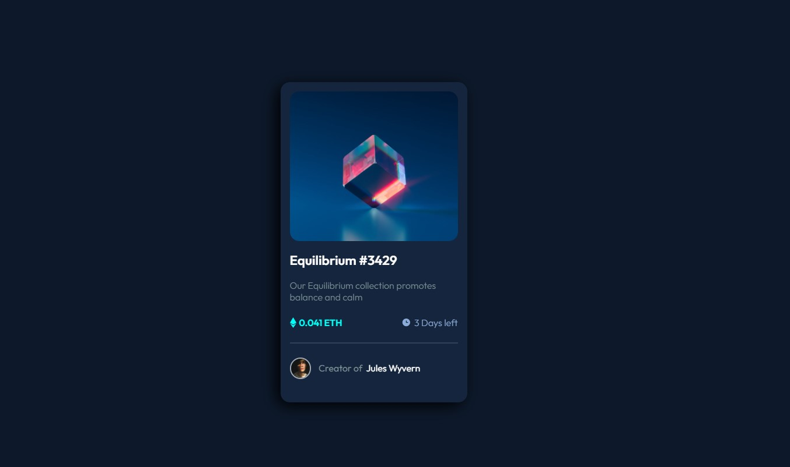
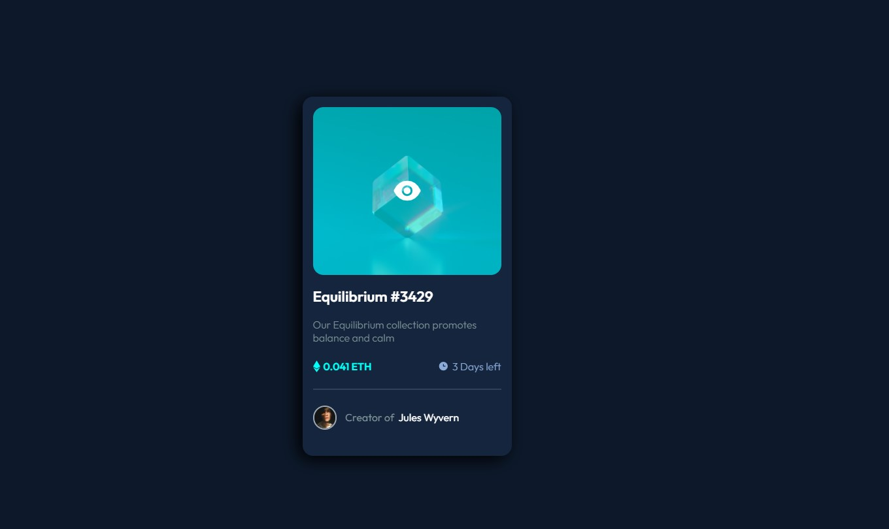
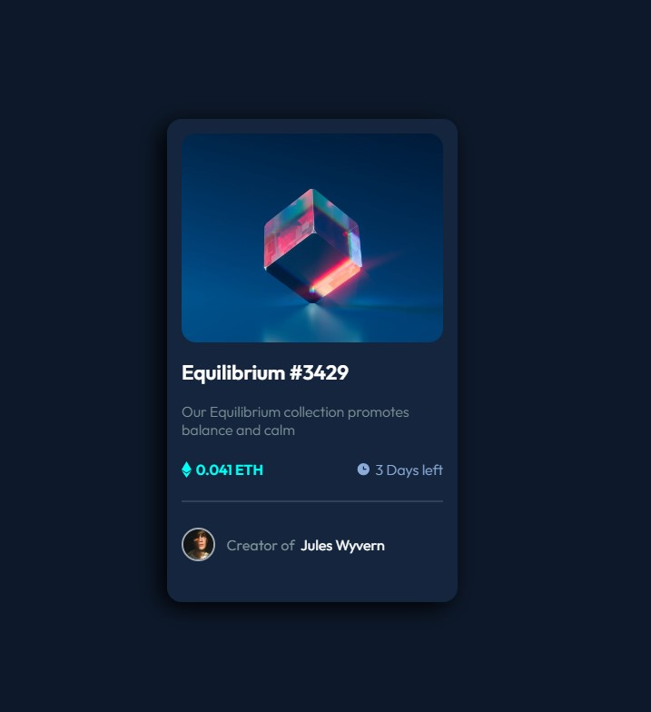
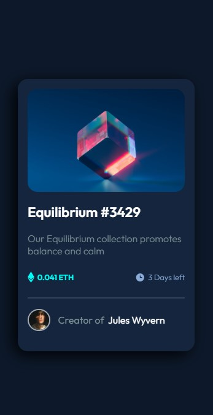

# Frontend Mentor - NFT Card

Practice using styled components for the first time.
Card does have a light/dark dependant on system theme settings.

---

### Links

##### [Link to project Frontend Mentor](https://www.frontendmentor.io/challenges/nft-preview-card-component-SbdUL_w0U)

## <!-- prettier-ignore -->

### Screenshots of my solution

#### Desktop version

 

  

#### Tablet version

  

#### Mobile version

 

---

### Screenshots of Frontend mentor's original solution

#### Desktop version

 

  

#### Mobile version

---
